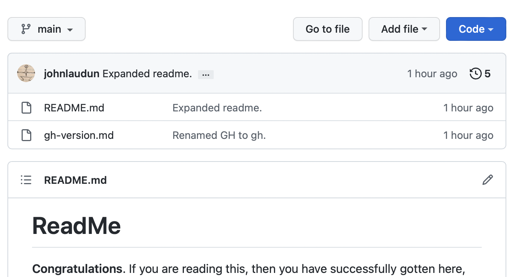
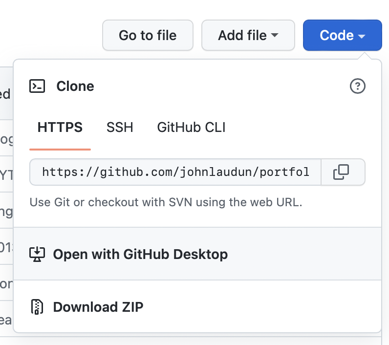

# ReadMe

**Congratulations**. If you are reading this, then you have successfully gotten here, and that was probably no easy task. You are reading this repository's *Read Me* file, which is the default file that GitHub shows in the web interface. It's where newcomers to a repository first look if they have any questions. It's a good idea always to have one and to be direct in your writing in/of it.

With the assumption that everyone learns a bit differently and sometimes even one person needs different ways to learn something, this explanation of GitHub and `git` has a number of possibly useful, possibly redundant materials or links to materials. You must decide when you know enough, for the time being, but you can also rely on these things being here in the future, so as you get familiar with the basics, or have questions about something that might be basic, you have a place to which you can turn.

This ReadMe is longer than most, and is divided into the following parts:

* The Essentials
* About `git` and GitHub
* What you need to do

Feel free to skip around in a way that makes the most sense to you.

https://github.com/adam-p/markdown-here/wiki/Markdown-Cheatsheet

## The Essentials

### What you need to know

Git is a bit of software that keeps track of the changes you make to files. It was designed to do this for programmers, and so it works best with plain text files. As we discuss in class, plain text files are not only smaller but more robust than rich text files (`.rtf`) or Microsoft Word files (`.docx`). 

Plain text files are great, but there are a lot of things they do not do well: I've yet to encounter a plain text slide generator that didn't either make slides worse than PowerPoint or make their production infinitely harder than PowerPoint, which is saying something in my book. They cannot in and of themselves track changes, for example, which is something that any one producing any kind of artifact, and especially complex ones like software programs or essays, would like to be able to do. 

That is where a **version control** system comes in. There are a lot of version control systems out there, some of which are centralized -- like *Subversion* -- and some of which are decentralized -- like *Hg* or *Git*. Each kind of systems has its strengths and weaknesses, but what you need to know for now is that Git is decentralized, which means that you can maintain a version of a document on your computer, and so can a bunch of other people and no one's version is *the* version until you have compared and merged all the versions. That sounds mind-boggingly complex, which is why people use version control software like Git. It keeps the hair on their heads -- unless baldness is your jam.

So, great, you are in a class that's going to require you not to use Microsoft Word, which is like the *de facto* standard in countless businesses, organizations, and government agencies -- trust me when I say I know of which I speak. The fact is most people use Word and PowerPoint and Excel really badly. I mean really, really badly. But they think it's all good because, hey, this got **bolded** and over here …

* this got bulleted.

So that must be important or good or something, right?

The fact is there is a reason why dynamic companies like Amazon have turned away from PowerPoint decks, and toward 6-page essays (more on this later), and more hide-bound organizations like the U.S. Army end up producing *PowerPoint Rangers*. 

My hope is that in making you work in an unfamliar way in an unfamiliar environment you will think about the process of research, thinking, and writing differently than you have before. And that is why we are using plain text and we are using version control. And why we are using GitHub so that, in the end, you own your work and it's not in someone else's file format.

Okay, so two things rolled into one: plain text and version control, but in this moment, we have to get you into/onto GitHub so you have a place to put plain text documents and then we will work on making your plain texts do as much as most Word documents. (Please note that by claiming this I am thinking about the vast trove of Word documents that do no more than a lot of one-off chracter formatting and not those that use Word's style system -- if you have no idea what that is, you're the problem.)

*If you want to jump ahead to the notes about plain text, see [texted.md]() in this repository.*

### What you need to do

There's a lot to Git and GitHub, but you have to get started somewhere and *soon*. So here are your steps — please note that URLs are not provided on purpose.

1. **Sign up for a GitHub account**. I recommend that you use some version of your name so that you can continue to use GitHub as you move from school into a professional environment. While I used my full name for my account, the convention is to use initials and then your last name. (This is especially the case for women, because, sadly, women still have to deal with discrimination and harrassment.) My long-time collaborator has the username `kmkinnaird`. 
2. **Download GitHub Desktop**. This should offer to install the command line version of `git` if it isn't on your system already. 
3. **Create a repo on GitHub**. The name isn't important: it's important that you create a repo. Follow the prompts that the GitHub website provides. 
4. **Clone the repo to your computer**. This is where things get interesting. Do you see that blue **Code** button? (See Figure 1.) If you click on it, you will get a menu. One of the options should be *Open with GitHub Desktop*. If so, click on that. If not, click the copy button to the right URL provided (see Figure 2 below), and paste that into GitHub Desktop after you choose the *Clone* option under the **File** menu. You will need to decided where to keep your repositories on your computer. Because `git` is itself a version control system, many people suggest you do not keep it OneDrive, DropBox, or iCloud. Most programmers have a directory (folder) in their user directory where they keep their repositories. I use `Developer` because the macOS recognizes that is a special kind of folder and gives it a special kind of icon. (Oh, boy!) 

## Resources

Here are some introductions to `git` and GitHub that might be useful:

* It probably isn't the best place to start, but GitHub classroom has a basic document that they offer as a template and is included here as [The GitHub Version of GitHub and Version Control](gh-version.md).
* A better place to start for most will be Tom van Antwerp's [GitHub for Non-Programmers: A guide to using GitHub for people who don't code and don't want to code](https://github.com/tvanantwerp/github-for-non-programmers).
* There is also Devon Broglie and Rebecca Parker's [Git and GitHub Basics](http://dh.obdurodon.org/github.xhtml) which is intended for students in their course in the digital humanities.
* And there is also Olivia Wikle and Adam Sowards' [Introduction to GitHub](https://learn-static.github.io/hist-320/github.html) which is part of their course on 20th-Century History & Text Analysis. 
* Finally, Jacob Fiksel posted a short document to help his biostatistics [students get started on Github](https://github.com/jfiksel/github-classroom-for-students).

This brief guide draws upon the work of all of the above. My thanks to them for sharing their work and helping all of us get better.