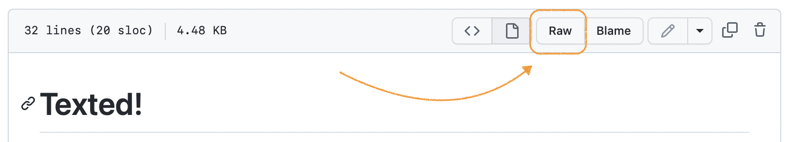

# Texted!

*If you want to know what this note is all about, click on the Raw button just above.*



Plain text is what it says on the label: a plain text file contains only the chracters you have typed into it. There are no hidden characters -- save a few like newline characters `\n` and tab characters `\t` that you really can see if you insist on it. 

Before we go any further, let's first sing the praises of formatted text: it's truly amazing how much we can do in terms of designing documents that are beautiful on pages or on screens. Once upon a time, I would have only imagined it only in terms of print, but, once upon a time, a single character was the product of a single piece of lead. Not so much in the case of most word processing documents:

The RTF version of "what is says on the label":

```
{\rtf1\ansi\ansicpg1252\cocoartf2639
\cocoatextscaling0\cocoaplatform0{\fonttbl\f0\fswiss\fcharset0 Helvetica;}
{\colortbl;\red255\green255\blue255;}
{\*\expandedcolortbl;;}
\margl1440\margr1440\vieww11520\viewh8400\viewkind0
\pard\tx720\tx1440\tx2160\tx2880\tx3600\tx4320\tx5040\tx5760\tx6480\tx7200\tx7920\tx8640\pardirnatural\partightenfactor0

\f0\fs24 \cf0 what it says on the label}
```

Microsoft Word's XML is similar, and, again, used wisely and well there's a lot of functionality to be had. But there's also a lot of functionality to be had using nothing more than plain text which enjoys, as noted before, incredibly small file sizes, which makes it easy to move them around, either backing them up or sharing them with others -- while there are claims to this being the era of broadband internet, the future is not evenly distributed -- as well as, thanks to its very plainness, incredible robustness and stability.

Look, nothing digital is simple: even plain text files have some dimensions you probably don't want to think about -- their encoding, for example, can be ASCII or UTF-8 or something else. But what plain files do offer is a file that you can open almost anywhere and using a variety of applications, many of which are free. I am, for example, writing this in Microsoft's Visual Studio Code app, which is free to download, and lets me not only edit files but also commit them and upload them to a repository. (It also does a lot of other things, which I will leave for a later discussion.)

And plain text files can come in a variety of flavors, or dialects if you prefer, which is the focus of this note. We are going to use a form of plain text that is widely popular in the digital humanities and data science known as [markdown](https://en.wikipedia.org/wiki/Markdown). You may, in fact, have already used it in an online forum: Slack uses it. 

There are other plain text formats, some of which offer more (and better) funtionality, but none has yet to approach markdown in terms of popularity. The original version of Markdown was designed with the intent of making it easy to write in plain text and then, by passing the plain text through a system of substitutions, have it come out on the other end as simple HTML. Thus, a line of text, no matter how long that was followed by two new lines, or returns, became an HTML `<p>`. Text that appeared between `*`asterisks`*` became *italicized* (or actually emphasized, `<em>`, in HTML). And so on. 

Headings and bullet points and links, all the essential stuff of basic, structured HTML, were there, even the ability to embed images. What was missing, from a scholarly point of view, were things like notes and the ability to handle some of the citational infrastructure -- which is perhaps why LaTeX remains an integral part of the publishing workflow in the sciences. (And please note that while none of these setups are necessarily intuitive, they are, above all, free. Microsoft Word might appear to be intuitive, since some of you have been using it since grade school, but it isn't, especially if you are to use it wise and well, which most of you don't. And it is most definitely not free: it's just that your parents, or your parents' work, or your school, and now your university pay for you to use it.)

There are other versions of markdown that have other kinds of functionality, and should your wizardry head in that direction, you can try them out for yourself. So many in fact that there is an effort to develop a common specification, [CommonMark](https://commonmark.org). BTW, CommonMark's [10-minute tutorial](https://commonmark.org/help/) is incredible, and that link will take you to a cheatsheet, and here's another popular [markdown cheatsheet](https://github.com/adam-p/markdown-here/wiki/Markdown-Cheatsheet). 